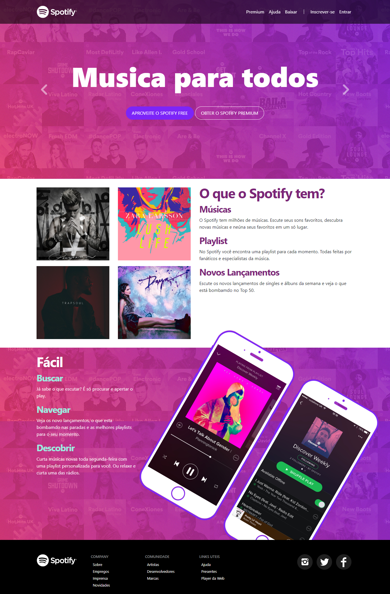
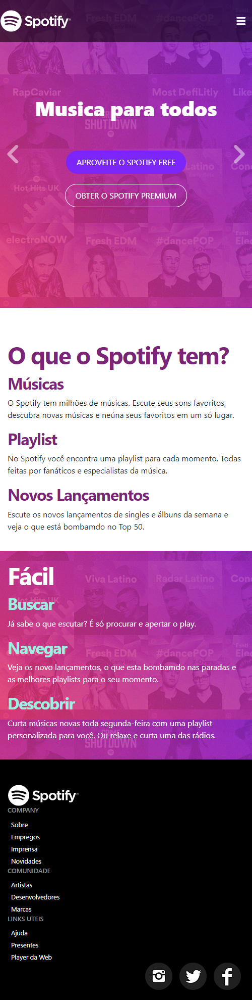

# Projeto Spotify Clone
Projeto criado em conjunto com o professor Jamilton Damasceno no curso de Bootstrap

[Link do Projeto](https://rafael0125.github.io/projeto_spotify_clone/)

#### Tecnologias usadas no projeto

  * Html 5
  * CSS 3
  * Bootstrap

### Versão Desktop

### Versão Mobile

